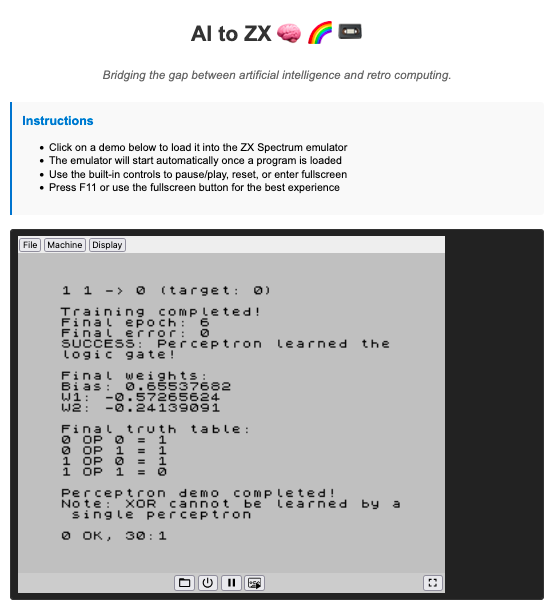

# AI to ZX 🧠 🌈 📼

## Overview

**AI to ZX** is a collection of artificial intelligence (AI) and computational demonstrations running on the legendary ZX Spectrum computer.

This project bridges the gap between retro computing nostalgia and modern AI concepts by implementing classic algorithms within 1980s hardware constraints.

Programs are written in ZX BASIC, compiled to Z80 machine code, and run in a web-based emulator (JSSpeccy).

**[Try the demos online →](https://jgalego.github.io/AI-to-ZX/)**


## Prerequisites

To build and run this project locally, you'll need the following tools installed on your system:

- **Python 3.11+** is required to run the ZX BASIC compiler
- **bash** for running build scripts (pre-installed on macOS/Linux, use WSL on Windows)
- **curl** for downloading JSSpeccy emulator files
- **unzip** for extracting downloaded archives  
- **jq** for generating demo metadata

## Getting Started

1. Clone the repository

   ```bash
   git clone --recursive https://github.com/JGalego/AI-to-ZX.git
   cd AI-to-ZX
   ```

2. Download JSSpeccy emulator

   ```bash
   ./scripts/download-jsspeccy.sh
   ```

3. Build the demos

   ```bash
   # Build all demos
   ./scripts/build.sh
   
   # or a specific demo
   ./scripts/build.sh Perceptron
   ```

4. Serve locally

   ```bash
   # Using Python's built-in server
   python3 -m http.server 8000 --directory public
   
   # or using any other web server
   cd public && npx serve
   ```

5. Open in the browser

    

## References

### Books

* (Brain & Brain, 1984) [Artificial Intelligence on the Spectrum Computer: Make Your Micro Think](https://spectrumcomputing.co.uk/entry/2000035/Book/Artificial_Intelligence_on_the_Spectrum_Computer_Make_Your_Micro_Think)
* (Hartnell, 1984) [Exploring Artificial Intelligence on your Spectrum+ and Spectrum](https://archive.org/details/timhartnellvz200giantbookofgames/TimHartnell_ExploringArtificialIntelligenceOnYourSpectrum/)
* (Jones & Fairhurst, 1984) [Artificial Intelligence: ZX Spectrum](https://spectrumcomputing.co.uk/entry/2000463/Book/Artificial_Intelligence_ZX_Spectrum)

### Websites

* [DevOps for the Sinclair Spectrum - Part 1](https://www.markround.com/blog/2021/12/21/devops-for-the-sinclair-spectrum-part-1)

### Tools & Software

* **[ZX BASIC](https://zxbasic.readthedocs.io/)**: a BASIC cross-compiler for the ZX Spectrum
* **[JSSpeccy](https://github.com/gasman/jsspeccy3)** - A JavaScript-based ZX Spectrum emulator that runs in web browsers